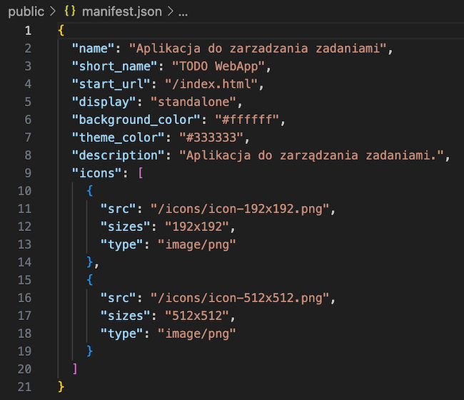
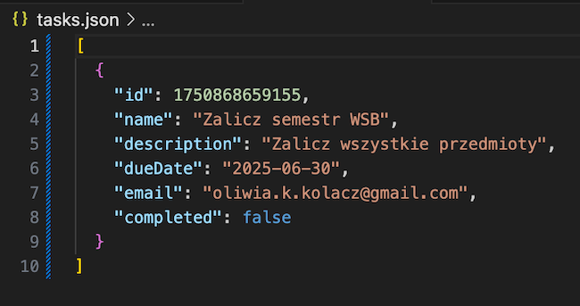
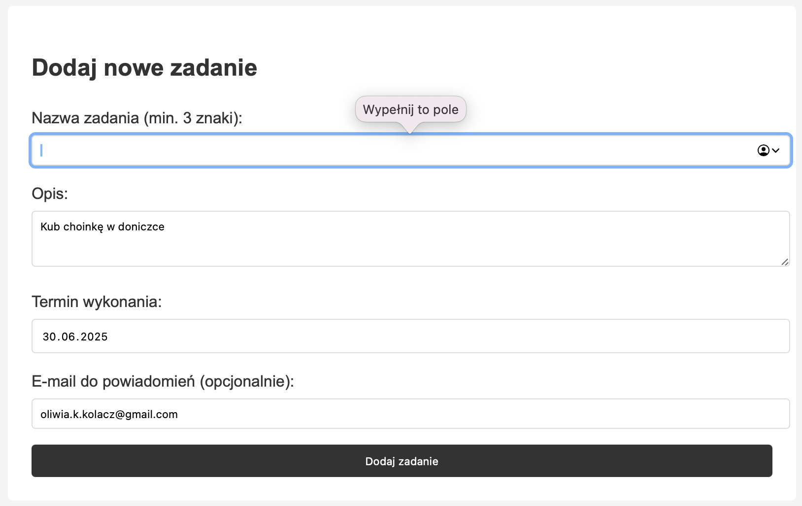

# Nazwa Projektu

Aplikacja "TODO" - do zarządzania zadaniami

## Opis projektu

Aplikacja pozwala na dodawanie, usuwamie, wyświetlanie zadań do zrobienia i oznaczania ich jako wykonane.

## Technologia

+ Node.js (m.in. package.json, routing, moduł express)
+ JavaScript (m.in. zdarzenia, walidacja formularzy)
+ Progressive Web App (m.in. manifest, service worker)


+ JSON (m.in. baza danych oparta na JSON)

+ HTML (m.in. znaczniki semantyczne, inputy)
+ CSS


## Widok aplikacji





## Uruchomienie

```
npm install
npm start
```

Strona dostępna jest pod: http://localhost:3000

## Autor

Oliwia Kołacz